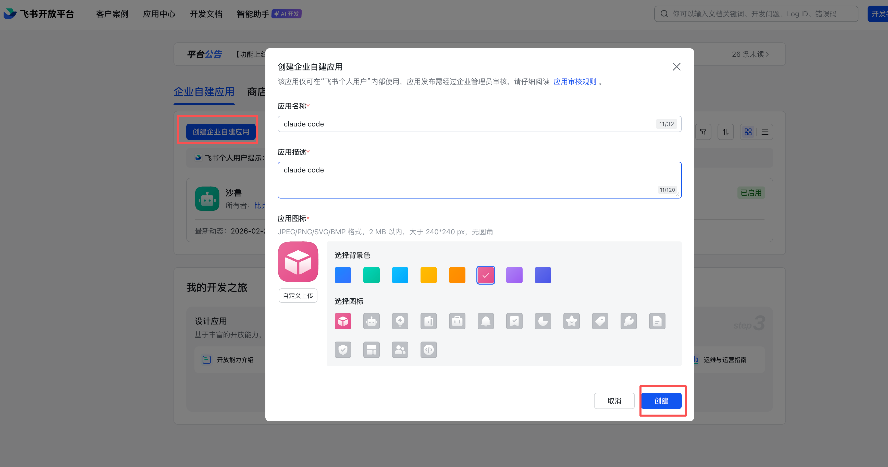
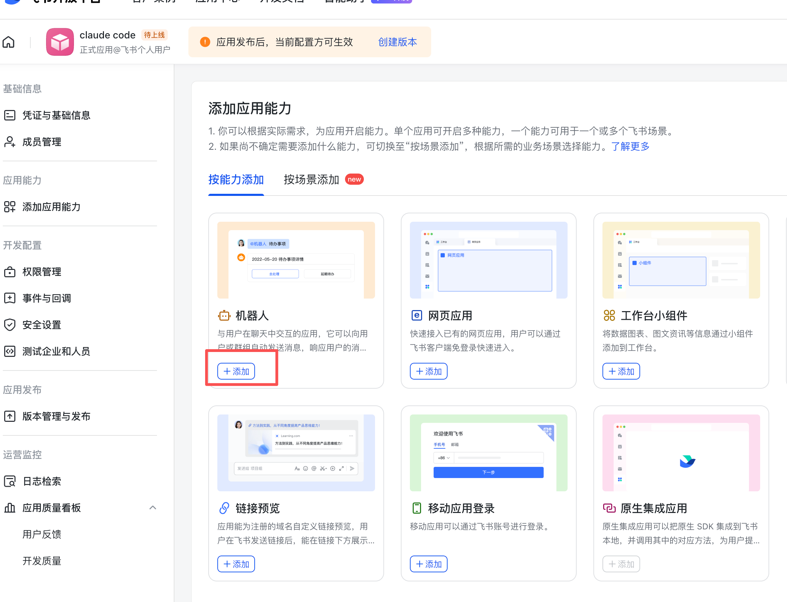
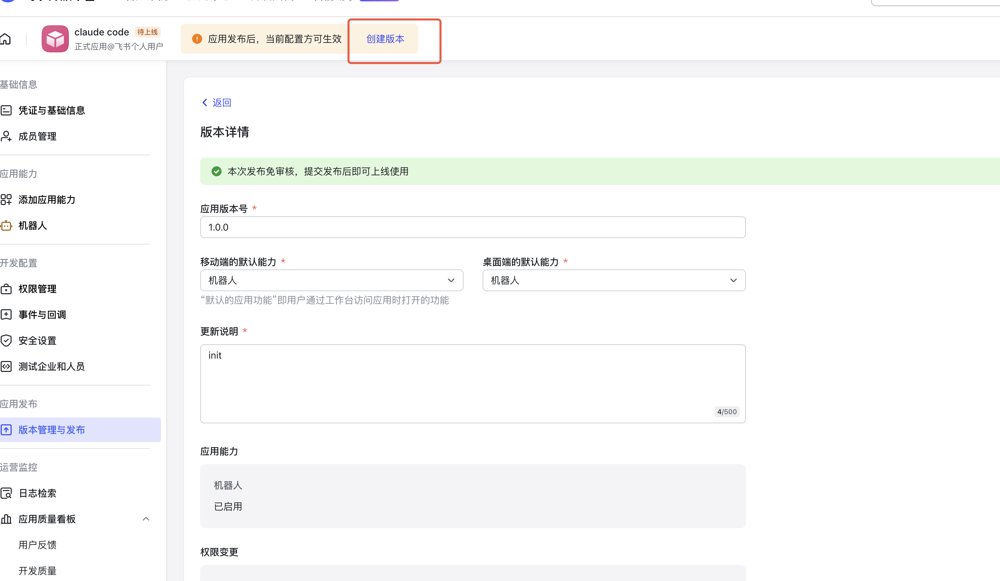
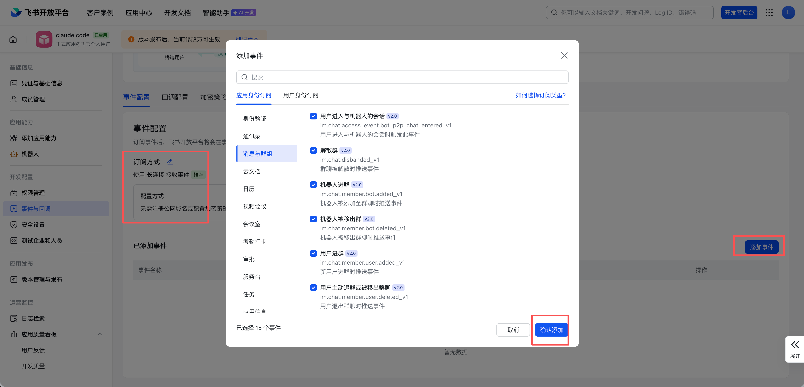

# cc-channel

> 飞书/Lark 通道 for Claude Code - 通过飞书消息触发 Claude Code

一个轻量级服务，让你可以通过飞书/Lark 使用 Claude Code。向你的飞书机器人发送消息，即可获得运行在本地机器上的 Claude Code 的响应。

[English](#english-version)

## 功能特性

- 🚀 **简单安装** - 一条命令初始化
- 💬 **多轮对话** - 跨消息保持上下文
- 🔄 **后台服务** - 以守护进程运行，无需终端
- 📁 **独立工作目录** - 每个会话可以有自己的工作目录
- 🌐 **WebSocket 连接** - 无需公网 IP 或端口转发

## 前置条件

- Node.js 18+
- 已安装并配置 [Claude Code CLI](https://claude.ai/code)
- 飞书/Lark 自建应用（见下方配置指南）

## 安装

```bash
npm install -g cc-channel
```

## 快速开始

### 第 1 步：创建飞书应用

1. 访问 [飞书开放平台](https://open.feishu.cn/app)（国际版使用 [Lark Developer](https://open.larksuite.com/app)）
2. 点击"创建企业自建应用"



### 第 2 步：添加机器人能力

在应用设置中，进入"应用能力"，添加"机器人"：



### 第 3 步：配置权限

1. 进入"权限管理" → "批量导入/导出权限"
2. 粘贴以下权限配置：

```json
{
  "scopes": {
    "tenant": [
      "base:app:copy",
      "base:app:create",
      "base:app:read",
      "base:app:update",
      "base:collaborator:create",
      "base:collaborator:delete",
      "base:collaborator:read",
      "base:dashboard:copy",
      "base:dashboard:read",
      "base:field:create",
      "base:field:delete",
      "base:field:read",
      "base:field:update",
      "base:form:read",
      "base:form:update",
      "base:record:create",
      "base:record:delete",
      "base:record:read",
      "base:record:retrieve",
      "base:record:update",
      "base:role:create",
      "base:role:delete",
      "base:role:read",
      "base:role:update",
      "base:table:create",
      "base:table:delete",
      "base:table:read",
      "base:table:update",
      "base:view:read",
      "base:view:write_only",
      "bitable:app",
      "bitable:app:readonly",
      "board:whiteboard:node:create",
      "board:whiteboard:node:delete",
      "board:whiteboard:node:read",
      "board:whiteboard:node:update",
      "contact:contact.base:readonly",
      "contact:user.base:readonly",
      "contact:user.employee_id:readonly",
      "contact:user.employee_number:read",
      "contact:user.id:readonly",
      "docs:doc",
      "docs:doc:readonly",
      "docs:document.comment:create",
      "docs:document.comment:read",
      "docs:document.comment:update",
      "docs:document.comment:write_only",
      "docs:document.content:read",
      "docs:document.media:download",
      "docs:document.media:upload",
      "docs:document.subscription",
      "docs:document.subscription:read",
      "docs:document:copy",
      "docs:document:export",
      "docs:document:import",
      "docs:event.document_deleted:read",
      "docs:event.document_edited:read",
      "docs:event.document_opened:read",
      "docs:event:subscribe",
      "docs:permission.member",
      "docs:permission.member:auth",
      "docs:permission.member:create",
      "docs:permission.member:delete",
      "docs:permission.member:readonly",
      "docs:permission.member:retrieve",
      "docs:permission.member:transfer",
      "docs:permission.member:update",
      "docs:permission.setting",
      "docs:permission.setting:read",
      "docs:permission.setting:readonly",
      "docs:permission.setting:write_only",
      "docx:document",
      "docx:document.block:convert",
      "docx:document:create",
      "docx:document:readonly",
      "drive:drive",
      "drive:drive.metadata:readonly",
      "drive:drive.search:readonly",
      "drive:drive:readonly",
      "drive:drive:version",
      "drive:drive:version:readonly",
      "drive:export:readonly",
      "drive:file",
      "drive:file.like:readonly",
      "drive:file.meta.sec_label.read_only",
      "drive:file:download",
      "drive:file:readonly",
      "drive:file:upload",
      "drive:file:view_record:readonly",
      "event:ip_list",
      "im:app_feed_card:write",
      "im:biz_entity_tag_relation:read",
      "im:biz_entity_tag_relation:write",
      "im:chat",
      "im:chat.access_event.bot_p2p_chat:read",
      "im:chat.announcement:read",
      "im:chat.announcement:write_only",
      "im:chat.chat_pins:read",
      "im:chat.chat_pins:write_only",
      "im:chat.collab_plugins:read",
      "im:chat.collab_plugins:write_only",
      "im:chat.managers:write_only",
      "im:chat.members:bot_access",
      "im:chat.members:read",
      "im:chat.members:write_only",
      "im:chat.menu_tree:read",
      "im:chat.menu_tree:write_only",
      "im:chat.moderation:read",
      "im:chat.tabs:read",
      "im:chat.tabs:write_only",
      "im:chat.top_notice:write_only",
      "im:chat.widgets:read",
      "im:chat.widgets:write_only",
      "im:chat:create",
      "im:chat:delete",
      "im:chat:moderation:write_only",
      "im:chat:operate_as_owner",
      "im:chat:read",
      "im:chat:readonly",
      "im:chat:update",
      "im:datasync.feed_card.time_sensitive:write",
      "im:message",
      "im:message.group_at_msg:readonly",
      "im:message.group_msg",
      "im:message.p2p_msg:readonly",
      "im:message.pins:read",
      "im:message.pins:write_only",
      "im:message.reactions:read",
      "im:message.reactions:write_only",
      "im:message.urgent",
      "im:message.urgent.status:write",
      "im:message.urgent:phone",
      "im:message.urgent:sms",
      "im:message:readonly",
      "im:message:recall",
      "im:message:send_as_bot",
      "im:message:send_multi_depts",
      "im:message:send_multi_users",
      "im:message:send_sys_msg",
      "im:message:update",
      "im:resource",
      "im:tag:read",
      "im:tag:write",
      "im:url_preview.update",
      "im:user_agent:read",
      "sheets:spreadsheet",
      "sheets:spreadsheet.meta:read",
      "sheets:spreadsheet.meta:write_only",
      "sheets:spreadsheet:create",
      "sheets:spreadsheet:read",
      "sheets:spreadsheet:readonly",
      "sheets:spreadsheet:write_only",
      "space:document.event:read",
      "space:document:delete",
      "space:document:move",
      "space:document:retrieve",
      "space:document:shortcut",
      "space:folder:create",
      "wiki:member:create",
      "wiki:member:retrieve",
      "wiki:member:update",
      "wiki:node:copy",
      "wiki:node:create",
      "wiki:node:move",
      "wiki:node:read",
      "wiki:node:retrieve",
      "wiki:node:update",
      "wiki:setting:read",
      "wiki:setting:write_only",
      "wiki:space:read",
      "wiki:space:retrieve",
      "wiki:space:write_only",
      "wiki:wiki",
      "wiki:wiki:readonly"
    ],
    "user": []
  }
}
```

3. 点击"申请开通" → "确认"

### 第 4 步：创建版本

创建版本来激活应用：



记录下应用凭证页面中的 **App ID** 和 **App Secret**。

### 第 5 步：初始化 cc-channel

回到终端执行：

```bash
cc-channel init
```

这将引导你完成：
- 输入飞书 App ID 和 Secret
- 设置默认工作目录
- 测试连接
- 启动后台服务

### 第 6 步：配置事件订阅（WebSocket）

1. 回到飞书开发者后台
2. 进入"事件与回调" → "事件配置"
3. 将"订阅方式"设置为"使用长连接接收事件"
4. 点击"添加事件"，勾选"消息与群组"下的所有事件



### 第 7 步：再次创建版本

创建另一个版本来激活事件订阅配置。

### 第 8 步：开始使用

1. 将机器人添加到群聊，或与机器人发起单聊
2. 发送任意消息即可触发 Claude Code！

## 使用方法

### 命令行

```bash
# 初始化配置
cc-channel init

# 启动后台服务
cc-channel start

# 前台运行（用于调试）
cc-channel start --foreground

# 停止后台服务
cc-channel stop

# 查看状态
cc-channel status

# 查看日志
cc-channel logs
cc-channel logs --follow

# 配置管理
cc-channel config list
cc-channel config set claude.defaultWorkDir ~/projects
```

### 聊天内命令

在飞书中与机器人对话时：

| 命令 | 说明 |
|------|------|
| （任意消息） | 使用 Claude Code 执行 |
| `/cc help` | 显示可用命令 |
| `/cc cd <path>` | 更改工作目录 |
| `/cc pwd` | 显示当前目录 |
| `/cc clear` | 清除对话历史 |
| `/cc status` | 显示会话状态 |

## 配置

配置文件存储位置（由 `conf` 库管理）：
- **macOS**: `~/Library/Preferences/cc-channel-nodejs/config.json`
- **Linux**: `~/.config/cc-channel-nodejs/config.json`
- **Windows**: `%APPDATA%\cc-channel-nodejs\Config\config.json`

使用 `cc-channel config list` 可查看当前配置和配置文件路径。

### 配置示例

```json
{
  "feishu": {
    "appId": "cli_xxxx",
    "appSecret": "xxxx",
    "verificationToken": "",
    "encryptKey": "",
    "domain": "feishu"
  },
  "claude": {
    "defaultWorkDir": "~",
    "timeout": 300000
  }
}
```

### 环境变量

也可以通过环境变量配置：

- `CC_CHANNEL_FEISHU_APP_ID`
- `CC_CHANNEL_FEISHU_APP_SECRET`
- `CC_CHANNEL_FEISHU_DOMAIN`
- `CC_CHANNEL_WORK_DIR`

## 工作原理

```
┌─────────────────┐     WebSocket      ┌─────────────────┐
│   飞书机器人     │ ◄───────────────► │   cc-channel    │
│   (云端)        │                    │   (本地)        │
└─────────────────┘                    └────────┬────────┘
                                                │
                                                │ spawn
                                                ▼
                                       ┌─────────────────┐
                                       │  Claude Code    │
                                       │  CLI            │
                                       └─────────────────┘
```

1. 你向飞书机器人发送消息
2. 飞书通过 WebSocket 将事件推送到 cc-channel
3. cc-channel 启动 Claude Code CLI 处理你的消息
4. 响应被发送回飞书

## 多轮对话

cc-channel 为每个会话维护对话历史：

- 每个会话（单聊或群聊）都有独立的 session
- 上下文会被传递给 Claude Code 用于后续问题
- 使用 `/cc clear` 开始新的对话

## 安全注意事项

- 只有能向你的飞书机器人发送消息的用户才能触发 Claude Code
- 所有执行都在你的本地机器上进行
- 会话数据存储在 `~/.cc-channel/sessions/`

## 故障排除

### Claude CLI 未找到

```bash
# 检查 claude 是否在 PATH 中
which claude

# 如果已安装但未找到，添加到 PATH
export PATH="$PATH:$(dirname $(which claude))"
```

### 连接问题

1. 验证 App ID 和 Secret 是否正确
2. 确保在飞书应用设置中启用了 WebSocket 模式
3. 检查日志：`cc-channel logs`

### 服务无法启动

```bash
# 检查服务状态
cc-channel status

# 尝试前台运行查看错误
cc-channel start --foreground
```

## 卸载

```bash
# 1. 停止后台服务
cc-channel stop

# 2. 卸载 npm 包
npm uninstall -g cc-channel

# 3. （可选）删除配置和会话数据
# macOS:
rm -rf ~/Library/Preferences/cc-channel-nodejs
rm -rf ~/.cc-channel
# Linux:
# rm -rf ~/.config/cc-channel-nodejs
# rm -rf ~/.cc-channel

# 4. （macOS）删除 launchd 服务文件
rm -f ~/Library/LaunchAgents/com.cc-channel.plist
```

如果 `cc-channel stop` 无法正常工作：

```bash
# macOS: 手动卸载 launchd 服务
launchctl bootout gui/$(id -u)/com.cc-channel 2>/dev/null

# 然后卸载
npm uninstall -g cc-channel
```

## 开发

```bash
# 克隆仓库
git clone https://github.com/L-x-C/cc-channel.git
cd cc-channel

# 安装依赖
npm install

# 构建
npm run build

# 本地运行
node dist/cli.js init
```

## 许可证

MIT

---

# English Version

> Feishu/Lark channel for Claude Code - trigger Claude Code from Feishu messages

A lightweight service that lets you use Claude Code from Feishu/Lark. Send messages to your Feishu bot and get responses from Claude Code running on your local machine.

## Features

- 🚀 **Easy setup** - One command initialization
- 💬 **Multi-turn conversations** - Maintains context across messages
- 🔄 **Background service** - Runs as a daemon, no terminal needed
- 📁 **Per-chat working directory** - Each chat can have its own working directory
- 🌐 **WebSocket connection** - No public IP or port forwarding required

## Prerequisites

- Node.js 18+
- [Claude Code CLI](https://claude.ai/code) installed and configured
- A Feishu/Lark self-built application (see setup guide below)

## Installation

```bash
npm install -g cc-channel
```

## Quick Start

### Step 1: Create a Feishu Application

1. Go to [Feishu Open Platform](https://open.feishu.cn/app) (or [Lark Developer](https://open.larksuite.com/app) for international)
2. Click "Create Self-built Application"


### Step 2: Add Bot Capability

In the app settings, go to "App Capabilities" and add "Bot":


### Step 3: Configure Permissions

1. Go to "Permission Management" → "Batch Import/Export Permissions"
2. Paste the permission configuration (see Chinese version above for full JSON)
3. Click "Apply for Activation" → "Confirm"

### Step 4: Create First Version

Create a version to activate the app:


Note down your **App ID** and **App Secret** from the app credentials page.

### Step 5: Initialize cc-channel

Back in your terminal:

```bash
cc-channel init
```

This will guide you through:
- Entering your Feishu App ID and Secret
- Setting the default working directory
- Testing the connection
- Starting the background service

### Step 6: Configure Event Subscription (WebSocket)

1. Go back to Feishu Developer Console
2. Navigate to "Events & Callbacks" → "Event Configuration"
3. Set "Subscription Method" to "Use Long Connection"
4. Click "Add Event" and select all events under "Messages & Groups"


### Step 7: Create Second Version

Create another version to activate the event subscription.

### Step 8: Start Using

1. Add your bot to a group chat, or start a direct message with the bot
2. Send any message to trigger Claude Code!

## Usage

### Commands

```bash
# Initialize configuration
cc-channel init

# Start background service
cc-channel start

# Start in foreground (for debugging)
cc-channel start --foreground

# Stop background service
cc-channel stop

# Show status
cc-channel status

# View logs
cc-channel logs
cc-channel logs --follow

# Configuration
cc-channel config list
cc-channel config set claude.defaultWorkDir ~/projects
```

### In-Chat Commands

When messaging the bot in Feishu:

| Command | Description |
|---------|-------------|
| (any message) | Execute with Claude Code |
| `/cc help` | Show available commands |
| `/cc cd <path>` | Change working directory |
| `/cc pwd` | Show current directory |
| `/cc clear` | Clear conversation history |
| `/cc status` | Show session status |

## Configuration

Configuration file locations (managed by `conf` library):
- **macOS**: `~/Library/Preferences/cc-channel-nodejs/config.json`
- **Linux**: `~/.config/cc-channel-nodejs/config.json`
- **Windows**: `%APPDATA%\cc-channel-nodejs\Config\config.json`

Use `cc-channel config list` to view current configuration and config file path.

### Example Configuration

```json
{
  "feishu": {
    "appId": "cli_xxxx",
    "appSecret": "xxxx",
    "verificationToken": "",
    "encryptKey": "",
    "domain": "feishu"
  },
  "claude": {
    "defaultWorkDir": "~",
    "timeout": 300000
  }
}
```

### Environment Variables

You can also configure via environment variables:

- `CC_CHANNEL_FEISHU_APP_ID`
- `CC_CHANNEL_FEISHU_APP_SECRET`
- `CC_CHANNEL_FEISHU_DOMAIN`
- `CC_CHANNEL_WORK_DIR`

## How It Works

```
┌─────────────────┐     WebSocket      ┌─────────────────┐
│   Feishu Bot    │ ◄───────────────► │   cc-channel    │
│   (Cloud)       │                    │   (Local)       │
└─────────────────┘                    └────────┬────────┘
                                                │
                                                │ spawn
                                                ▼
                                       ┌─────────────────┐
                                       │  Claude Code    │
                                       │  CLI            │
                                       └─────────────────┘
```

1. You send a message to your Feishu bot
2. Feishu pushes the event via WebSocket to cc-channel
3. cc-channel spawns Claude Code CLI with your message
4. The response is sent back to Feishu

## Multi-turn Conversations

cc-channel maintains conversation history per chat:

- Each chat (direct message or group) has its own session
- Context is passed to Claude Code for follow-up questions
- Use `/cc clear` to start a fresh conversation

## Security Considerations

- Only users who can message your Feishu bot can trigger Claude Code
- All execution happens locally on your machine
- Session data is stored in `~/.cc-channel/sessions/`

## Troubleshooting

### Claude CLI not found

```bash
# Check if claude is in PATH
which claude

# If installed but not found, add to PATH
export PATH="$PATH:$(dirname $(which claude))"
```

### Connection issues

1. Verify your App ID and Secret are correct
2. Make sure WebSocket mode is enabled in Feishu app settings
3. Check logs: `cc-channel logs`

### Service not starting

```bash
# Check service status
cc-channel status

# Try running in foreground to see errors
cc-channel start --foreground
```

## Uninstallation

```bash
# 1. Stop the background service
cc-channel stop

# 2. Uninstall the npm package
npm uninstall -g cc-channel

# 3. (Optional) Remove configuration and session data
# macOS:
rm -rf ~/Library/Preferences/cc-channel-nodejs
rm -rf ~/.cc-channel
# Linux:
# rm -rf ~/.config/cc-channel-nodejs
# rm -rf ~/.cc-channel

# 4. (macOS) Remove launchd service file
rm -f ~/Library/LaunchAgents/com.cc-channel.plist
```

If `cc-channel stop` doesn't work properly:

```bash
# macOS: Manually unload launchd service
launchctl bootout gui/$(id -u)/com.cc-channel 2>/dev/null

# Then uninstall
npm uninstall -g cc-channel
```

## Development

```bash
# Clone the repo
git clone https://github.com/L-x-C/cc-channel.git
cd cc-channel

# Install dependencies
npm install

# Build
npm run build

# Run locally
node dist/cli.js init
```

## License

MIT
